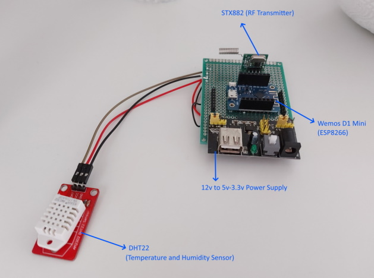
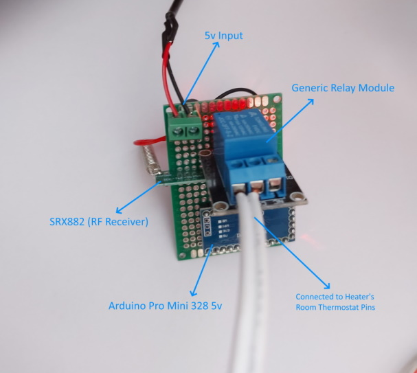
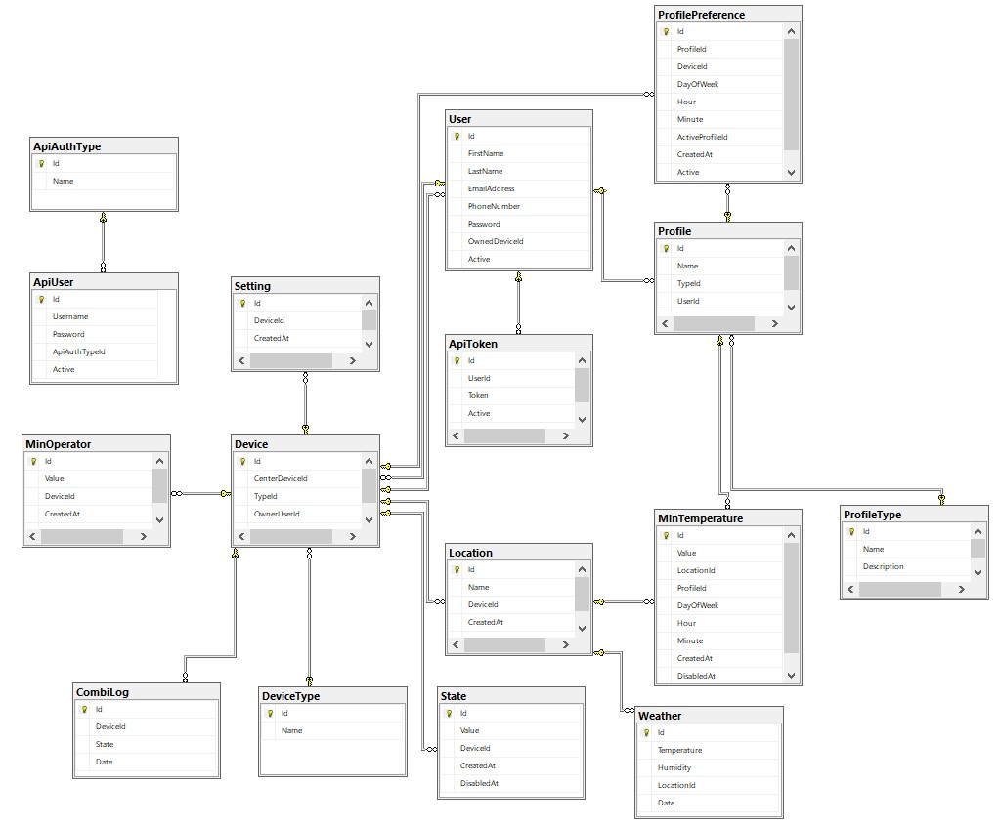

# KombiCim
IoT Room temperature control project

This project aims to keep room at a stable temperature that can be change by user. 
Project has 4 parts and these are 
- Web API | **.NET Framework C#**
- Center ESP8266 device that connects WiFi(API), measure temperature by DHT22, sends RF 433mhz signals to other device to turns on/off heating system | **Arduino C/C++**
- Arduino (any) device that receives command via RF 433mhz from center and turns on/off the heating system | **Arduino C/C++**
- Simple Android application that users can login, control temperature or manually turns on or off | **Native Android - Kotlin**

Necessary devices:
- ESP8266 based board (NodeMCU, D1 Mini etc.)
- Arduino based board (Arduino Uno/Mini/Pro etc.)
- DHT22 Temperature/Humidity Sensor
- Any RF433Mhz Transmitter/Receiver (Must be compatible with ASK.h) (I try all rf433mhz sets and my choice is STX882/SRX882)
- Standard Relay module

TODOS:
- Add circuit diagram
- Add project design diagram
- Develop weekly scheduled control (with RTC module)

--------------------------------

**Center Device** -> Connected to WiFi, measures temperature and send commands to Heater device via RF

**Heater Device** -> Receives Turn on/off commands via RF and controls Relay

-----------------------

**Database Diagram**

